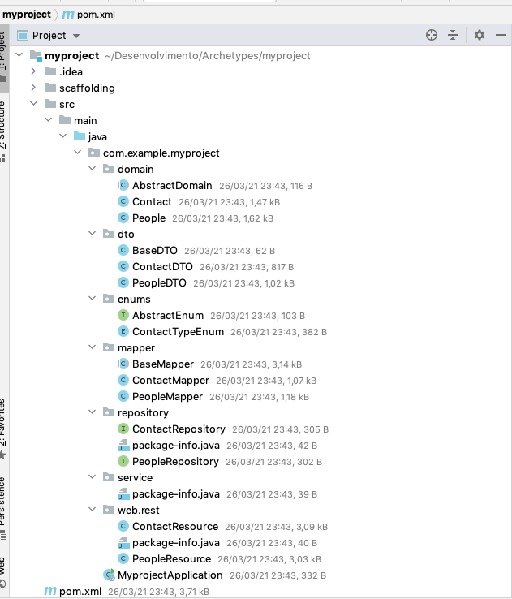

# Scaffolding Maven Plugin

Maven plugin to use the [scaffolding-console](../scaffolding-console/README.md) within a maven project.

## How to use

To use just configure repository and plugin in your maven pom file.

```
<pluginRepositories>
    <pluginRepository>
        <id>scaffolding-maven</id>
        <url>https://raw.github.com/rdabotelho/mvn-repo/scaffolding-maven/</url>
    </pluginRepository>
</pluginRepositories>
```

```
<profiles>
    <profile>
        <id>scaffolding</id>
        <activation>
            <activeByDefault>false</activeByDefault>
        </activation>
        <build>
            <plugins>
                <plugin>
                    <groupId>com.m2r.scaffolding</groupId>
                    <artifactId>scaffolding-maven</artifactId>
                    <version>1.0.0</version>
                    <executions>
                        <execution>
                            <phase>compile</phase>
                            <configuration>
                                <baseDir>${project.basedir}</baseDir>
                            </configuration>
                            <goals>
                                <goal>run</goal>
                            </goals>
                        </execution>
                    </executions>
                </plugin>
            </plugins>
        </build>
    </profile>
</profiles>
```

## Creating an example project with scaffolding archetype

The best way to understand how the scaffolding console works is to generate a project from scratch using one of the available demo archetypes in its repository.

The demo archetype creates a microservice in spring-boot with two entities: People and Contact:

So came on! 

First create the project directory.

```
mkdir myproject
cd myproject
```

Then create a pom.xml file

```
<?xml version="1.0" encoding="UTF-8"?>
<project xmlns="http://maven.apache.org/POM/4.0.0"
         xmlns:xsi="http://www.w3.org/2001/XMLSchema-instance"
         xsi:schemaLocation="http://maven.apache.org/POM/4.0.0 http://maven.apache.org/xsd/maven-4.0.0.xsd">
    <modelVersion>4.0.0</modelVersion>

    <groupId>com.example.myproject</groupId>
    <artifactId>myproject</artifactId>
    <version>1.0.0-SNAPSHOT</version>

    <properties>
        <maven.compiler.target>1.8</maven.compiler.target>
        <maven.compiler.source>1.8</maven.compiler.source>
    </properties>

    <pluginRepositories>
        <pluginRepository>
            <id>scaffolding-maven</id>
            <url>https://raw.github.com/rdabotelho/mvn-repo/scaffolding-maven/</url>
        </pluginRepository>
    </pluginRepositories>

    <profiles>
        <profile>
            <id>scaffolding</id>
            <activation>
                <activeByDefault>false</activeByDefault>
            </activation>
            <build>
                <plugins>
                    <plugin>
                        <groupId>com.m2r.scaffolding</groupId>
                        <artifactId>scaffolding-maven</artifactId>
                        <version>1.0.0</version>
                        <executions>
                            <execution>
                                <phase>compile</phase>
                                <configuration>
                                    <baseDir>${project.basedir}</baseDir>
                                </configuration>
                                <goals>
                                    <goal>run</goal>
                                </goals>
                            </execution>
                        </executions>
                    </plugin>
                </plugins>
            </build>
        </profile>
    </profiles>

</project>
```

Now, execute the following maven command to call the [scaffolding-console](../scaffolding-console/README.md):

```
mvn compile -Pscaffolding
```

In the first time, you will be asked if you want to create the scaffolding configuration folder. You must answer 1 (yes) to create an initial setup.

```
Scaffolding configuration folder not found in the project. Do you want create it?
1: yes
2: no
Enter your choice 1
```

You will be asked for the type of archetype. Answer the number 2 (ms-spring-boot):

```
Which artifact do you want to use?
1: mb-flutter
2: ms-spring-boot
3: quickstart
Enter your choice 2
```

You will be asked for the name and the base package of the project.

```
What is the project name? myproject
What is the base package? com.example.myproject
```

Once answered, the initial scaffolding structure will be created in the `/scaffolding` folder.

```
The ms-spring-boot archetype was created with success!
bye!
```

In the project directory the scaffolding folder will be created with the following structure:

```
-scaffolding
    -base
    -scripts
    -templates
```

- `base`: Folder that will be copied in the code generation. It is important to create an initial project structure.
- `scripts`: Folder to store the DSL [Codegen](https://github.com/rdabotelho/codegen) files to define the domains (class, enum and relationship).
- `templates`: Folder to store the [Apache Velocity](https://velocity.apache.org) template files for code generation.

Open the main `scaffolding/scripts/domains.gc` file to see the script with the example domains.

```
class People (label: 'People') {
    String name (label: 'Name');
    String nickname (label: 'Nickname');
    List<Contact> contacts (label: 'Contact List');
}

class Contact (label: 'Contact') {
    ContactTypeEnum type;
    String value;
}

enum ContactTypeEnum {
    EMAIL (id: '1', description: 'Email');
    PHONE (id: '2', description: 'Phone');
}
```

Now again, execute the maven command to call the generation console and finally, to generate all the project artifacts (entity, enum, dto, mapper, repository and resource).

```
mvn compile -Pscaffolding
```

```
What scripts do you want to execute [all]? 
What templates do you want to generate [all]? 
Do you want to generate the base structure [no]?
1: yes
2: no
Enter your choice 1
Chosen yes

People.java generated with success!
PeopleDTO.java generated with success!
PeopleMapper.java generated with success!
PeopleRepository.java generated with success!
PeopleResource.java generated with success!
Contact.java generated with success!
ContactDTO.java generated with success!
ContactMapper.java generated with success!
ContactRepository.java generated with success!
ContactResource.java generated with success!
ContactTypeEnum.java generated with success!
Process conclude with success!
bye!
```

The result will be:



## Executing and testing the example project

Run the spring boot application:

```
mvn spring-boot:run
```

Now test the endpoint of POST in the url `http://localhost:8080/api/contacts`, creating two contacts:

```
curl -X POST \
  http://localhost:8080/api/contacts \
  -H 'content-type: application/json' \
  -d '{
	"type": "PHONE",
	"value": "11 9988-7766"
}'
```

```
curl -X POST \
  http://localhost:8080/api/contacts \
  -H 'content-type: application/json' \
  -d '{
	"type": "EMAIL",
	"value": "contact@gmail.com"
}'
```

After, test the GET endpoint in the url `http://localhost:8080/api/contacts`, listing the created contacts:

```
curl -X GET http://localhost:8080/api/contacts
```

The result will be:

```
[
    {
        "id": 1,
        "type": "PHONE",
        "value": "11 9988-7766"
    },
    {
        "id": 2,
        "type": "EMAIL",
        "value": "contact@gmail.com"
    }
]
```

For more information, access [scaffolding-console](../scaffolding-console/README.md)
